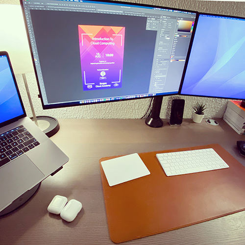

# 100 Days of Cloud - Day 01

## Getting Started!

Follow my adventure at [@cloudkarl](https://instagram.com/cloudkarl) ! [1/100] I’m joining @developerdylan and others in the #100daysofcode 🧑🏻‍💻 just with a slight variation! Since I’m not necessarily a full time developer, I’m doing the #100daysofCLOUD ☁️ challenge! 🚀

I’ll be spending a bit of time each day learning or working with cloud solutions as a way to further my learning. It’s currently a Saturday and I just started my vacation, which will allow for some time each day to learn something new for the next couple of weeks.

What am I starting with? Working on a tarting a cloud for beginners meetup group in the Bergen area! More information in the future, but if you’re interested hit me up, should be fun!

